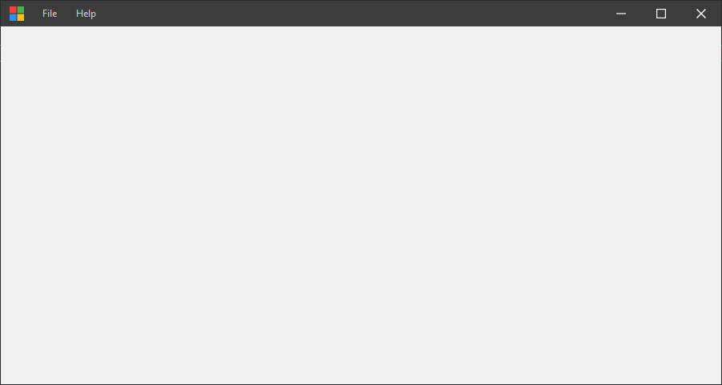
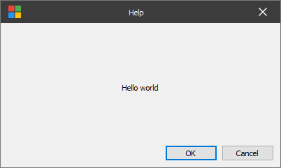

Simplified version frameless Qt window from [qwindowkit](https://github.com/stdware/qwindowkit)

## Changes
1. Use original cmake functions, not [qmsetup](https://github.com/stdware/qmsetup)
1. Add `FramelessWindow` class for main window, `FramelessDialog` for dialog
1. Fix some bugs, e.g. debug output `ReturnHr(21) tid(89a4) 80070057 The parameter is incorrect.`

## Usage

### `FramelessWindow`
```cpp
FramelessWindow w;
w.setWindowIcon(QIcon(":/app/example.png"));
w.setWindowTitle(tr("demo"));
w.show();
```


### `FramelessDialog`
```cpp
FramelessDialog dialog;
dialog.setWindowTitle("Dialog");
dialog.setFixedSize(400, 240);
dialog.setCentralWidget(new QLabel("Hello world"));
dialog.exec();
```

